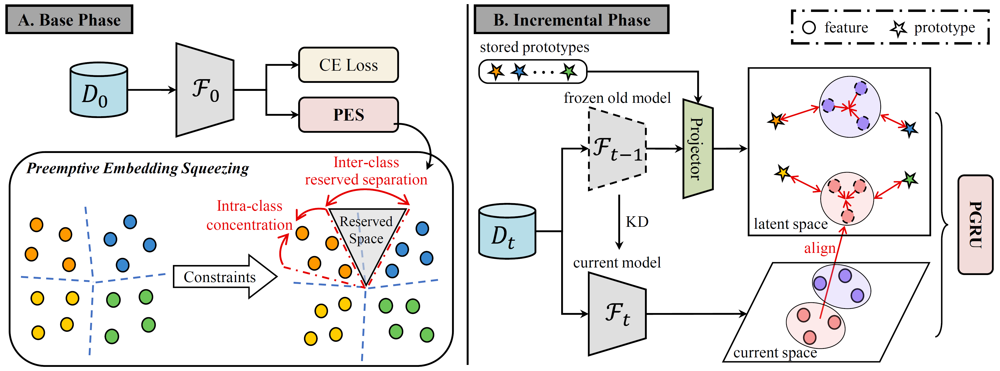

# NeurIPS2024-PRL
### [NeurIPS2024] Prospective Representation Learning for Non-Exemplar Class-Incremental Learning



[Wuxuan shi](https://shiwuxuan.github.io/), [Mang Ye](https://marswhu.github.io/)*

[Paper](https://openreview.net/pdf?id=ZtDARpmbun)

## Usage

* Training on CIFAR-100 dataset:

```
$ python main.py --config=exps/PRL/cifar.json
```
Please note to change the paths of the different datasets in `utils/data` to the paths of your dataset files

## Dataset
We provide a version of the ImageNet-Subset dataset (randomly seeded 1993) that has been segmented for academic research use only. Click [here](https://mega.nz/file/9ikj1bbB#Zax1V7Q1xPlkxu8C9bOq8Ocq6WAu_-jtyqvta2hkTN0) to get it. Please contact me immediately if infringement or violation is involved.

## Citation
We are glad that the information provided by this repository is useful for your research and would be grateful if you would consider citing:

```
@article{shi2024PRL,
  title={Prospective Representation Learning for Non-Exemplar Class-Incremental Learning},
  author={Shi, Wuxuan and Ye, Mang},
  journal={Advances in Neural Information Processing Systems},
  volume={37},
  pages={995--1018},
  year={2024}
}
```

**We thank the following repos providing helpful components/functions in our work.**
* [PyCIL](https://github.com/G-U-N/PyCIL)
* [TAMiL](https://github.com/NeurAI-Lab/TAMiL)
